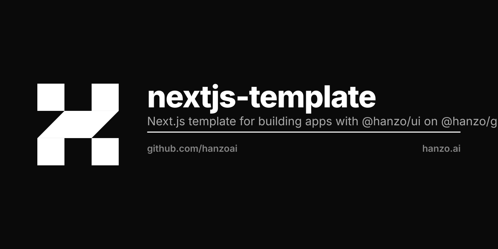

<p align="center"></p>

# nextjs-template

A Next.js template for building Hanzo apps with [@hanzo/ui](https://www.npmjs.com/package/@hanzo/ui) on [@hanzo/gui](https://www.npmjs.com/package/@hanzo/gui). Nothing is vendored: components are imported, the identity is CSS custom properties, and the same import renders on web, native and desktop.

```bash
npx create-next-app -e https://github.com/hanzoai/nextjs-template
```

## Features

- Next.js App Router
- @hanzo/ui components on the @hanzo/gui substrate — no Tailwind, no Radix, no vendored component tree
- Theme tokens as plain CSS custom properties (`@hanzo/ui/theme.css`)
- Dark mode via `@hanzogui/next-theme` + `ThemeToggleNext`
- Geist Sans + Geist Mono, self-hosted

## Commands

- Dev: `pnpm dev`
- Build: `pnpm build`
- Typecheck: `pnpm tc`

## License

Licensed under the [MIT license](LICENSE.md).
